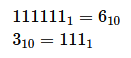

#Work on project. Stage 4/6: Any which radix
##Description

In this stage, you should add support for reading the source number in the given base and converting it to another given base.

##Algorithm

As there are 26 Latin letters and 10 digits, the maximum base is 26 + 10 = 36.

To convert a number from the source base to the target base, take the following steps:

- If the given number is not decimal, you can convert it to a decimal using the method ```Integer.parseInt(number, sourceBase)``` that returns a decimal representation of a number.
- After that, you can use the method ```Integer.toString(decimalNumber, newBase)``` that takes a decimal number and converts it to the target base.

Note that the minimum radix is 1: the number ```N``` in radix 1 contains the symbol ```1``` N times. The methods described above don’t work if ```sourceBase``` or ```newBase``` equal to 1. In that case, you should convert the numbers manually.

For instance:



This stage is auto-graded. The grader will input three lines:

1. The source radix;
2. The source number;
3. The target radix.

Then, it will check that your output contains the correct number representation in the given radix. This time, don't use prefixes now.

**Examples:**

Example 1:

Input:

    10
    11
    2

Output:

    1011

Example 2:

Input:

    1
    11111
    10

Output:

    5

Example 3:

Input:

    10
    4
    1

Output:

    1111

Example 4:

Input:

    10
    1001
    36

Output:

    rt