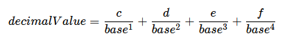

#Work on project. Stage 5/6: Converting fractions

##Description

Fractional numbers can also be converted from one base to another. To convert a fractional number to another base, you should use the algorithm described below.

##Algorithm

As you know from the previous stage, in order to convert a number from one base to another, first, we need to convert it to decimal if it’s not decimal yet, and only then convert it to another base. The same applies to fractional numbers.
Let’s imagine you have a fractional number __*ab.cdef*__ where __*ab*__ is the integer part, __*cdef*__ is the fractional part, and __*a,b,c,d,e,f*__  are some digits or letters, depending on the base of the number.
In this case, we have 2 digits (letters) in the integer part and 4 digits (letters) in the fractional part. In other cases, the number of digits (letters) in parts can be different.

To convert the number into decimal, we need to:

* Split the number into two parts: integer and fractional;
* Convert the integer part into decimal using the method from the previous stage;
* Convert the fractional part into decimal using the following formula:

The more digits (letters) in the fractional part, the more addends in the formula. If the fractional part has letters, then you should use their number representation: ‘a’ – 10, ‘b’ – 11, c – ‘12’, and so on.
As a result, you should get a decimal number no greater than 1. If it is greater than 1, you did something wrong.
To see the decimal representation of the source number, you can sum the decimal integer and the decimal fractional parts.
To convert a decimal fractional number into any other base, we need to:

* Split the decimal number into two parts: integer and fractional; 
* Convert the integer part into the new base;
* Convert the fractional part from decimal to any other base.

Let’s elaborate on the third step and convert the fractional part of 0.5168 into base 19 as an example.

Multiply the fractional part by the new base: **0.5168 ∗ 19 = 9.8192**. The integer part of the result is the first digit (or letter if the integer part is greater than 9) in the fractional part of a number in the new base. In this case, the first digit in the fractional part is **9**.
Take the fractional part from the result of the multiplication and multiply it by the new base again: **0.8192 ∗ 19 = 15.5648**. For numbers greater than 9, you should use their letter representation: 10 – ‘a’, 11 – ‘b’, 12 – ‘c’, and so on. In this case, the second digit (letter) is **f (15)**.
To calculate the rest of the digits (letters), repeat this action. In this stage, your program should output only 5 digits (letters) in the fractional part:

    0.5648 ∗ 19 = 10.7312 (a)
    0.7312 ∗ 19 = 13.8928 (d)
    0.8928 ∗ 19 = 16.9632 (g)

The final result looks like this: __0.516810 = 0.9*fadg*19__

Example 1:

0.23410 to base 7

1. **0.234 * 7 = 1.638**: the first fraction symbol is 1. 
2. Remove integer part. **0.638 * 7 = 4.466**: the second fraction symbol is 4. 
3. Remove integer part. **0.466 * 7 = 3.262**: the third fraction symbol is 3. 
4. The same for the next symbols.

So, the number in base 7 is **0.143...7**

Example 2:

0.23410 to base 36.

1. **0.234 * 36 = 8.424**: the first fraction symbol is 8.
2. **0.424 * 36 = 15.264**: the second fraction symbol is '15' and 'f' in base 36.
3. **0.264 * 36 = 9.504**: the third fraction symbol is 9.

So, the number in base 36 is 0.8f9...36

Example 3:

0.2347 to base 36.

1. Convert the fractional part to base 10 using the formula above: **2/7 + 3/49 + 4/343=0.358...10**
2. Convert this number to base 36 like in example 2.

This stage is auto-graded. The grader will input three lines: the source radix, the source number, and the target radix. Then it will check that your output is the correct number representation in the given radix. Don't forget to round up the result to 5 decimal places! If there is no fractional part in the initial number, you don't need to show the fractional part.

Also, numbers in radix 1 cannot have a fractional part so they're tested only as the integer part, like it was in the previous stage.
 

---

**Examples:**

Example 1:

Input:

    10
    0.234
    7

Output:

    0.14315

Example 2:

Input:

    10
    10.234
    7

Output:

    13.14315

Example 3:

Input:

    35
    af.xy
    17

Output:

    148.g88a8

Example 4:

Input:

    16
    aaaaa.0
    24

Output:

    22df2.00000

Example 5:

Input:

    21
    4242
    6

Output:

    451552

Example 6:

Input:

    1
    1111111
    10

Output:

    7